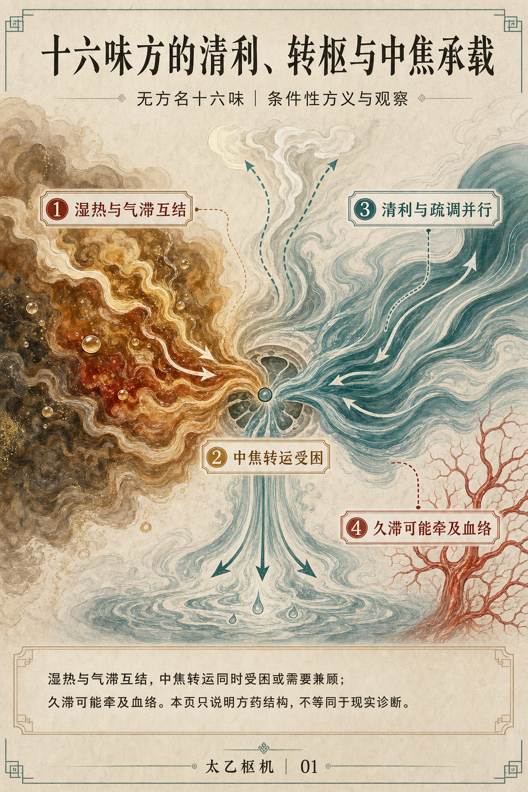

# Taiyi Shuji

[中文](README.md) · [MIT License](LICENSE)

Taiyi Shuji is a Traditional Chinese Medicine (TCM) analysis Skill for personal
agent hosts. It keeps classical interpretation, formula analysis, case reasoning,
same-case follow-up, and a lightweight personal case record on one verifiable
mainline, with explicit source, result-identity, and failure boundaries.

The project uses the model, native subagents, signed-in account, and usage quota
already provided by hosts such as Codex. It does not require a separate model API.
Model knowledge and TCM reasoning remain primary. The local classics service only
supplies short, contiguous passages when a direct quotation, attribution,
provenance boundary, or counterexample needs verification.

> This project is for research and personal study of TCM classics and formulas.
> It is not a medical device and does not provide a diagnosis or prescription
> that can be acted on without review. Case and formula conclusions require
> review by a suitably qualified professional. The images below demonstrate
> report presentation only; they do not establish medical validity.

## Visual examples

These images come from one conditional analysis of an unnamed formula. A
pure-image report is an optional presentation of the committed text result. It
does not alter the analysis or create a second medical state.

<p align="center">
  
  
</p>

## Main capabilities

| Capability | Description |
|---|---|
| Classical interpretation | Explains passages, concepts, and cross-text relationships; direct classical claims can be bound to a short quotation and document anchor |
| Formula analysis | Supports named or unnamed formulas, one or many ingredients, same-formula continuation, and comparison; conclusions remain conditional when no patient facts are available |
| Case reasoning | Preserves current facts and performs foundational analysis, medical translation, syndrome differentiation, and formula reasoning within the TCM system |
| Same-case follow-up | Binds an explicit parent turn, compares prior predictions with current observations, and re-evaluates whether to continue, adjust, change, or reassess |
| Personal case record | Stores facts, ambiguities, prior clinician opinions, actual formulas, observed response, corrections, and committed result identities |
| Red-team review | Formula, case, and follow-up tasks use one isolated red-team reviewer; Stage C runs once only when a material conflict exists |
| Text and visual output | Complete text is the default; a read-only mobile H5 or pure-image report can be generated from the same committed result on explicit request |

## Reasoning mainline

Formal tasks use three causal responsibilities:

1. **R0** establishes qi, yin-yang, relevant *Yijing* relationships, and any
   necessary five-phase direction without prematurely assigning organs,
   channels, syndromes, or treatment.
2. **R1** translates R0 into human qi transformation, the six channels and eight
   principles, organs and channels, disease movement, and formula-pattern
   relationships. Competing explanations are checked before one core mechanism
   is retained.
3. **R2** develops treatment principles, whole-formula structure, conditional
   recommendations, Day 1/2/3 observations, and exit boundaries.

The host completes R0–R2 sequentially in one context. Formula, case, and follow-up
tasks then call one isolated red-team context that does not inherit the host
conversation. If it finds a material conflict, the host performs one Stage C
synthesis. There is no fixed multi-agent pipeline or voting system.

## Runtime requirements

- Codex or another host that supports Agent Skills, file access, and terminal execution;
- one isolated native subagent for red-team review;
- Python 3.10 or later;
- `jsonschema>=4.23,<5`;
- macOS or Linux. Windows users should use WSL; native Windows has not been separately validated;
- H5 output uses repository scripts only. Pure-image reports additionally require image-generation capability from the host.

No standalone model API is required. If the host cannot create an isolated
subagent, formula, case, and follow-up tasks must not claim that formal red-team
review was completed.

## Installation

```bash
git clone https://github.com/gethlx/taiyi.git
cd taiyi

python3 -m venv .venv
source .venv/bin/activate
python3 -m pip install -r requirements.txt
```

For Codex, install the Skill with a symbolic link so that its relative access to
`spec/`, `tools/`, and `kb/` remains intact:

```bash
mkdir -p ~/.codex/skills
ln -s "$PWD/skill/taiyi-shuji" ~/.codex/skills/taiyi-shuji
```

If a Skill with the same name already exists at the destination, inspect it and
choose whether to keep, rename, or update it. Do not overwrite it blindly. Start
a new host task after installation or update so that the Skill is reloaded.

## Usage

Invoke `$taiyi-shuji` explicitly in the host conversation. Typical requests:

```text
Use $taiyi-shuji to explain how “one yin and one yang are called the Way” in the Yijing relates to the Cantong qi.
```

```text
Use $taiyi-shuji to analyze this unnamed formula: Yinchen, Patrinia, Sedum sarmentosum, Gardenia...
There are no patient facts. Keep the formula meaning, pattern conditions, and Day 1/2/3 observations conditional.
```

```text
Use $taiyi-shuji to record the facts of this case and perform TCM case reasoning. The patient’s exact words are: ...
```

```text
Use $taiyi-shuji to follow up on the currently active case. The changes since the previous treatment are: ...
```

```text
Generate a read-only mobile H5 for the current committed result.
```

Recording, reading, or correcting case facts does not start the full medical
mainline. A plain explanation of an existing committed result does not create a
new run, turn, or result. Hypothetical formula changes use one copy-on-write
sandbox and do not modify the formal case.

## Local classics corpus

The public repository does not redistribute the complete digital classics
corpus. Source licenses differ, and some digital providers permit only private
or limited academic use. Direct quotation retrieval requires a Markdown corpus
and `manifest.json` that the user has the right to use under `kb/`. See
[`kb/README.md`](kb/README.md) for the directory contract.

Without a local corpus, the model can still perform general TCM reasoning, but
unread text must not be presented as a verified direct quotation or attribution.

## Tests

Run the public source checks with:

```bash
python3 -B tools/validate.py
```

When a complete local corpus is installed, the same command also runs retrieval,
source readback, Tangye rules, and direct-source tests. They may also be run
individually:

```bash
python3 -B tools/retrieval.py validate
python3 -B tools/test_retrieval.py
python3 -B tools/tangye.py validate
```

Machine tests cover deterministic identity, conservation, provenance, role
isolation, and atomic commit boundaries. They do not judge yin-yang analysis,
mechanism, formula meaning, materia medica, treatment quality, or red-team
medical quality.

## Repository layout

```text
skill/taiyi-shuji/   Skill entry point, role references, scripts, and presentation assets
spec/                Role prompts, machine contracts, schemas, and test data
tools/               Contracts, retrieval, evidence service, and deterministic tests
kb/                  User-supplied local classics corpus
docs/images/         Pure-image report examples used by the README
```

See [`PRODUCT.md`](PRODUCT.md) for product boundaries,
[`THEORY_CORE.md`](THEORY_CORE.md) for reasoning responsibilities,
[`ARCHITECTURE.md`](ARCHITECTURE.md) for implementation architecture, and
[`spec/MACHINE_CONTRACT.md`](spec/MACHINE_CONTRACT.md) for the machine contract.

## License

Software, original documentation, and the example images in this repository are
available under the [MIT License](LICENSE). Third-party materials and local
classics are not relicensed by the software license. See
[`THIRD_PARTY_NOTICES.md`](THIRD_PARTY_NOTICES.md).
