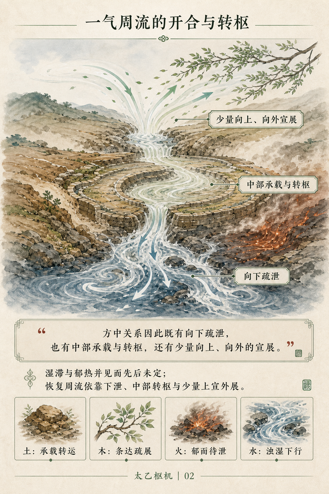
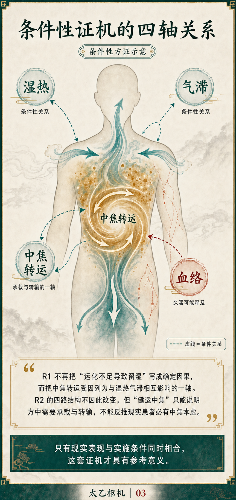
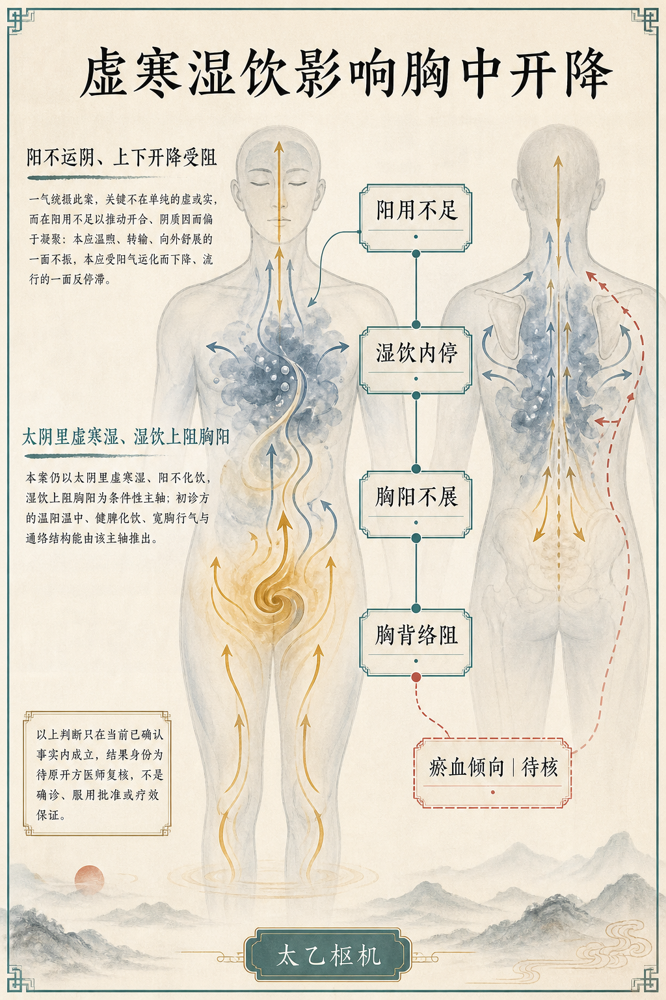

# 太乙枢机

[English](README.en.md) · [MIT License](LICENSE)

面向个人使用的中医研析 Agent Skill，当前主要适配并验收于 Codex。

太乙枢机把经典解释、方剂分析、病例辨证、同案复察和简要个人病历放在同一条
可核验主线上。模型预训练知识和中医推理是主体；随仓库提供的数字典籍知识库
负责核对直接原文、出处、调用权、反面证据和关键边界。项目不要求独立模型 API。

> 本项目用于中医经典研究、方剂研析和个人学习，不是医疗器械，也不提供未经
> 专业复核即可执行的诊断或处方。示例图片只展示报告表达方式，不证明医学结论
> 有效。

## 可以做什么

| 能力 | 说明 |
|---|---|
| 经典解释 | 解释原文、概念和跨书关系；直接经典主张可绑定短原文与文档锚点 |
| 方剂分析 | 支持有方名或无方名、一味或多味组成、同方续析与方剂比较；没有患者事实时保持条件性 |
| 病例辨证 | 保存患者原话与本轮事实，在中医体系内完成元典关系、医学转译、辨证和方药分析 |
| 同案复察 | 绑定明确父轮，对照上轮预测和本轮反应，重新判断守方、调整、转方或重辨 |
| 个人病历 | 记录事实、含混项、既有医者意见、实际用方、治疗反应、纠正和正式结果身份，不建设完整病历系统 |
| 同源表达 | 默认输出完整文字；用户明确要求后，可从同一正式结果生成只读 H5 或纯图片报告 |

## 快速开始

### 运行环境

- Codex；这是当前唯一完成安装和运行验收的 Agent 宿主；
- 宿主可创建一个隔离子代理，用于方剂、病例和复察的红方审计；
- Python 3.10 或更高版本；
- macOS 或 Linux。Windows 建议使用 WSL，尚未单独验收；
- 纯图片报告需要 Codex 提供图像生成、局部编辑和原图复核能力。

其他 Agent 可能具备类似的 Skill、文件、终端或子代理能力，但本项目尚未完成
兼容测试。宿主不能创建隔离子代理时，不应声称已经完成正式红方审计。

### 安装

```bash
git clone https://github.com/gethlx/taiyi.git
cd taiyi

python3 -m venv .venv
source .venv/bin/activate
python3 -m pip install -r requirements.txt
```

Codex 建议使用符号链接安装，以保留 Skill 与仓库中 `spec/`、`tools/`、`kb/` 的
相对关系：

```bash
mkdir -p ~/.codex/skills
ln -s "$PWD/skill/taiyi-shuji" ~/.codex/skills/taiyi-shuji
```

如果目标位置已有同名 Skill，请先决定保留、改名或更新方式，不要直接覆盖。
安装或更新后新建一个 Codex 任务，使宿主重新加载 Skill。

### 在对话中使用

明确调用 `$taiyi-shuji`，并提供当前任务真正需要的事实。例如：

```text
使用 $taiyi-shuji 解释《周易》“一阴一阳之谓道”与《参同契》的关系。
```

```text
使用 $taiyi-shuji 分析以下无方名组成：茵陈、北败酱草、垂盆草、栀子……
没有患者事实，只做条件性方义、方证和 Day 1／2／3 观察。
```

```text
使用 $taiyi-shuji 建立本次病例事实并进行中医辨证。以下是患者原话：……
```

```text
使用 $taiyi-shuji 复察当前激活的同一病例。上次处理后的变化是：……
```

只记录、读取或纠正病历事实时，Skill 不启动完整医学主链。对已有正式结果作
普通解释不会新建 run、turn 或 result；假设改方使用写时复制沙盘，不改写正式
病例。H5 和纯图片报告只在文字结果完成、用户明确要求后生成。

## 工作方式

正式任务按三个因果职责推进：

1. **R0**：形成一气、阴阳、《周易》关系及必要的五行方向，不提前下沉为脏腑、
   六经、证型或治法。
2. **R1**：把 R0 转译到人体气化、六经八纲、脏腑经络、病势和方证，通过候选
   与反证回验收敛核心证机。
3. **R2**：完成治法、全方结构、条件性建议、Day 1／2／3 观察和退出边界。

R0—R2 由宿主在同一上下文中连续完成。典籍服务只提供当前推理需要的短原文，
不会把整章或整部典籍灌入上下文。方剂、病例和复察随后调用一个不继承宿主对话
的隔离红方；发现实质冲突时，宿主只综合一次，不建立固定多代理流水线或投票。

正式结果一次提交，绑定本轮输入、来源、角色正文和结果身份。失败不会留下半成品
医学结果；H5 与图片只读取同一正式结果，不保存第二套医学状态。

## 输出示意

以下四页分别展示气化方向、条件性证机、病例病因病机与方药结构。四页都来自
正式文字分析的同源可视化，不形成独立解释层。

<table>
  <tr>
    <td width="50%" align="center">
      <br>
      <strong>R0 · 气化分析</strong><br>一气周流、开合转枢与五行方向
    </td>
    <td width="50%" align="center">
      <br>
      <strong>R1 · 条件性证机</strong><br>人体气化、病势关系与辨证边界
    </td>
  </tr>
  <tr>
    <td width="50%" align="center">
      <br>
      <strong>病例 · 病因病机与辨证</strong><br>由本轮事实形成证机链，保留待核边界
    </td>
    <td width="50%" align="center">
      <br>
      <strong>R2 · 方药结构</strong><br>治法方向与方内分组关系
    </td>
  </tr>
</table>

## 数字典籍与验证

仓库包含 Skill 实际读取的处理后知识库：

- `kb/manifest.json`：18 部典籍的稳定身份、运行路径和 SHA-256；
- `kb/texts/`：分书、统一编码、补入结构标题与稳定锚点后的唯一运行正文；
- `kb/assets/辅行诀/`：汤液图、经法规则及相关结构化校验资产。

原始下载快照和历史合并源文件不进入运行包。知识库清单、登记正文或结构化资产
缺失、被替换或哈希不符时，正式运行必须停止。结构与来源说明见
[`kb/README.md`](kb/README.md) 和
[`THIRD_PARTY_NOTICES.md`](THIRD_PARTY_NOTICES.md)。

完整检查：

```bash
python3 -B tools/validate.py
```

也可以单独检查知识库：

```bash
python3 -B tools/retrieval.py validate
python3 -B tools/test_retrieval.py
python3 -B tools/tangye.py validate
```

机器测试验证身份、守恒、来源、角色隔离和原子提交等确定性边界，不判断阴阳、
病机、方义、药性、治法或红方医学质量。

## 项目文档与许可

- [产品边界](PRODUCT.md)
- [理论核与职责](THEORY_CORE.md)
- [实施架构](ARCHITECTURE.md)
- [机器契约](spec/MACHINE_CONTRACT.md)
- [证据服务](spec/RETRIEVAL.md)

软件代码、原创文档和仓库示例图采用 [MIT License](LICENSE)。第三方数字典籍保留
各自来源与许可身份，不因本软件许可证而被重新授权。
