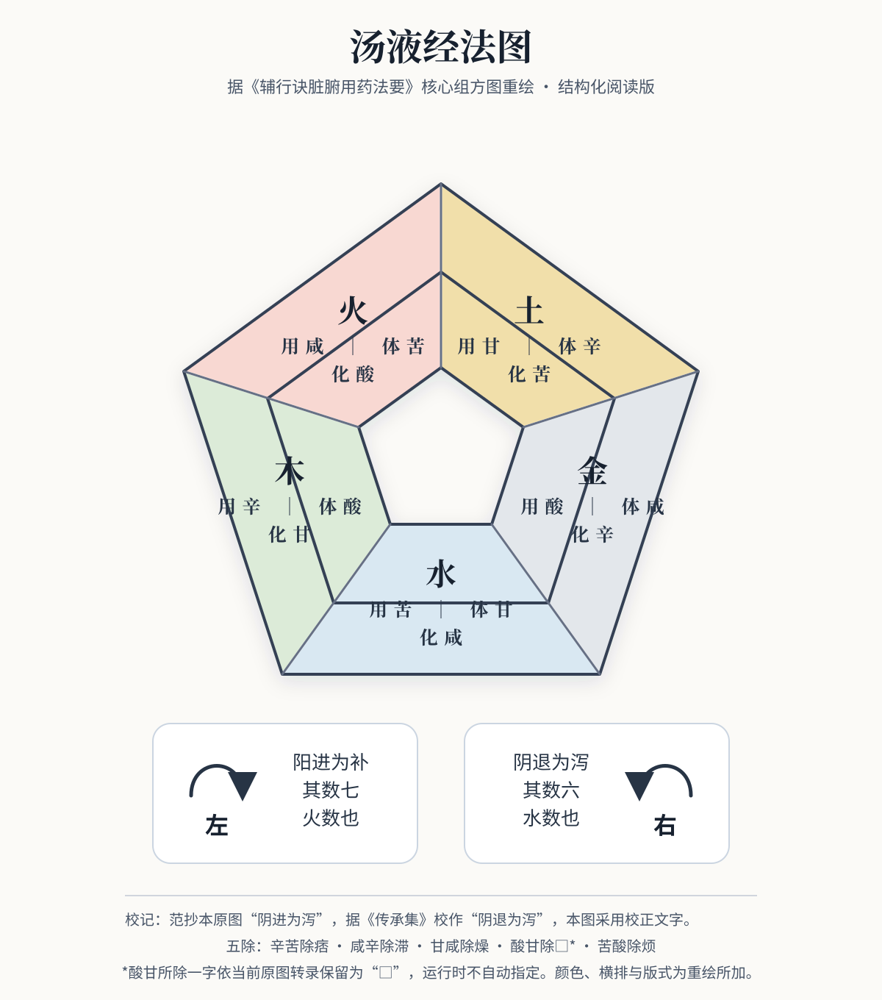

# 《汤液经法图》重绘与释读

本图采用 SVG 重建，因为其核心是固定文字、五边形分区和方向关系。SVG 便于放大、检索和逐项校验；[`汤液图.json`](汤液图.json) 保存机器可读关系。当前核心释义见[《汤液经法图》文字规则](经法规则.md)：先把原图改写成可证伪的文字语法，再用《伤寒》《金匮》方例寻找支持、限制和反例。

## 五脏体用化

下表依五脏条文“以某味补之、以某味泻之”对读图中文字，将“用”与补味、“体”与泻味对应；“化”记录体、用两味之间的配伍关系。这是对现存图文的编辑性定位，不表示任何处方都可仅凭三项自动生成。

| 脏 | 五行 | 用（补） | 体（泻） | 化 |
|---|---|---|---|---|
| 肝 | 木 | 辛 | 酸 | 甘 |
| 心 | 火 | 咸 | 苦 | 酸 |
| 脾 | 土 | 甘 | 辛 | 苦 |
| 肺 | 金 | 酸 | 咸 | 辛 |
| 肾 | 水 | 苦 | 甘 | 咸 |

这与正文五脏条文逐一对应，例如肝“以辛补之，以酸泻之；肝苦急，急食甘以缓之”。运行时固定按正文、图位和方例共同校准后的表中关系读取。

## 五味化合

| 配伍 | 化味 |
|---|---|
| 辛＋酸 | 甘 |
| 咸＋苦 | 酸 |
| 甘＋辛 | 苦 |
| 酸＋咸 | 辛 |
| 苦＋甘 | 咸 |

“化”是一项关系标记，不抹去两味原有属性，不额外产生一个可计数的药味，也不等同现代化学反应。

## 五除

| 配伍 | 图示作用 |
|---|---|
| 辛＋苦 | 除痞 |
| 咸＋辛 | 除滞 |
| 甘＋咸 | 除燥 |
| 酸＋甘 | 除□* |
| 苦＋酸 | 除烦 |

五除属于外圈两味配伍关系，统一按五个无序异味对表达，不分别挂到木、火、土、金、水单个分区。酸甘所除之字统一保留为原图转录 `□`，运行时不自动指定所除状态，也不以经方语义相似代替原图文字。

## 方向与方数

| 方向 | 进退 | 补泻 | 数 |
|---|---|---|---:|
| 左 | 阳进 | 补 | 7 |
| 右 | 阴退 | 泻 | 6 |

“阳进为补，其数七；阴退为泻，其数六”是原图文字事实，并与《辅行诀》大补、大泻方的七味、六味结构相应。七六数法固定用于《辅行诀》大补、大泻结构，不外推为《伤寒》《金匮》或一般方剂的通用味数算法，也不据此分类或生成处方。

## 校记与来源

- 本地主要见证：[`refs/gem/05_辅行诀.pdf`](../../../refs/gem/05_辅行诀.pdf)，PDF 第 17 页。
- 知识库文字本：[`texts/05_辅行诀.md`](../../texts/05_辅行诀.md)。
- 在线文字对照：[维基文库《辅行诀脏腑用药法要》](https://zh.wikisource.org/zh-hans/輔行訣臟腑用藥法要)。
- 体、用、化及五除释读参照：[《基于〈辅行诀〉组方理论探析真武汤制方思想》](https://xb.njucm.edu.cn/cn/article/pdf/preview/10.14148/j.issn.1672-0482.2022.1094.pdf)、[《从汤液经法图解析清肺排毒汤的配伍和功效》](https://journal-platform-1305836431.cos.ap-beijing.myqcloud.com/article_xml/2023/0425/1650743314921558016/中医学报/1674-8999-35-12-2487/1674-8999-35-12-2487.pdf)。

范抄本原图把“阴退为泻”误作“阴进为泻”，重绘依《传承集》注文校作“阴退”。本图是编辑性结构重绘，不是原书影摹本；它不能脱离方证和本草来源用于选药，也不构成临床处方建议。
